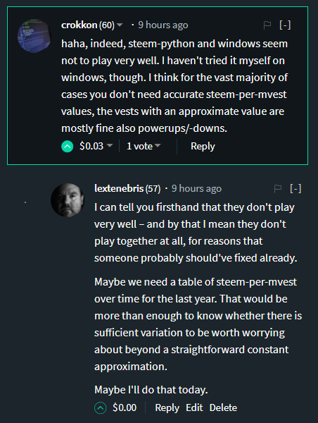

*Sometimes the rabbit hole goes deeper than you thought.*

[](https://steemit.com/steem/@lextenebris/steem-the-whale-wars-bernie-and-haejin-sitting-in-a-tree-structure#@crokkon/re-lextenebris-re-crokkon-re-lextenebris-re-abh12345-re-lextenebris-re-abh12345-re-lextenebris-steem-the-whale-wars-bernie-and-haejin-sitting-in-a-tree-structure-20180307t161114284z)

And so it began, with a simple back and forth between @crokkon and I, talking about the methods of deriving `steem-per-mvest` and whether or not it was even worth doing.

This is going to be an example of how asking the simplest questions can take you down some very strange rabbit holes, and if you're willing to follow them you can stumble on things you have no way of understanding. But at least you found them.

The basic question:

Has the effective ratio between steem and mega-vests changed significantly enough over the last year to even bother worrying about generating a precise ratio in order to determine how much a given vote is worth?

It seems like a very simple question to answer. And it is! But digging out the answer ends up revealing more than it intends.

## Getting Out the Shovel

Like most things lately that involve code, this starts simply enough by loading up the basics of SteamData, pulling in some useful analysis tools, and finishing off the imports with something to draw pretty pictures. I know up front that I'm going to want to plot at least one graph of the ratio between deposits and withdrawals in the table of operations of the system fulfilling requests to convert steem to SP.

If you've been following my code posts over the last few weeks, you know what's coming up now. Imports, database initialization, query, and then we start looking at the data we get back.


```python
# Setting up the imports 

from steemdata import SteemData
import datetime
from datetime import datetime as dt

import numpy as np

import bokeh
import bokeh.plotting as bplt
```


```python
# Init connection to database

db = SteemData()
```


```python
query = {
    'type' : 'fill_vesting_withdraw',
    'timestamp' : {'$gte': dt.now() - datetime.timedelta(days=360)}}
    
proj = {'deposited.amount': 1, 'withdrawn.amount': 1, 'timestamp': 1, 'from_account': 1, 'to_account':1, '_id': 0}

sort = [('timestamp', -1)]
```


```python
%%time

result = db.Operations.find(query,
                            projection=proj,
                            sort=sort)

fvL = list(result)
```

    Wall time: 1min 33s
    

I decided to go big rather than to go home and just grab the last year of transaction information on vesting withdrawals. That sounds like complete overkill, and it probably is, but as a result I can look at the data and really get a feeling for what's going on under the hood. Also, it gives us a chance to make a solid prediction (technically hindcast) of what the ratio was and how much it's varied.

It turns out that there are just over a million vesting withdrawals that occurred in the last year. Honestly, that could be a lot worse. We can really work with this amount of data.

While were looking, let's check out the first five and the last five in the list. Since I told the database to return the list in reverse chronological order, those at the top of the most recent and of those at the bottom are the oldest.


```python
len(fvL)
```


    1049438


```python
fvL[:3], fvL[-3:]
```


    ([{'deposited': {'amount': 35.77},
       'from_account': 'zakariashikder',
       'timestamp': datetime.datetime(2018, 3, 8, 18, 18, 33),
       'to_account': 'zakariashikder',
       'withdrawn': {'amount': 73050.513285}},
      {'deposited': {'amount': 20.336},
       'from_account': 'nobutsd',
       'timestamp': datetime.datetime(2018, 3, 8, 18, 17, 33),
       'to_account': 'nobutsd',
       'withdrawn': {'amount': 41531.82173}},
      {'deposited': {'amount': 0.927},
       'from_account': 'junhokim',
       'timestamp': datetime.datetime(2018, 3, 8, 18, 17, 12),
       'to_account': 'junhokim',
       'withdrawn': {'amount': 1894.72076}}],
     [{'deposited': {'amount': 65.278},
       'from_account': 'midnightoil',
       'timestamp': datetime.datetime(2017, 3, 13, 13, 32, 18),
       'to_account': 'midnightoil',
       'withdrawn': {'amount': 135825.952611}},
      {'deposited': {'amount': 43.866},
       'from_account': 'catulhu',
       'timestamp': datetime.datetime(2017, 3, 13, 13, 32, 9),
       'to_account': 'catulhu',
       'withdrawn': {'amount': 91274.494945}},
      {'deposited': {'amount': 5.902},
       'from_account': 'dennygalindo',
       'timestamp': datetime.datetime(2017, 3, 13, 13, 31, 36),
       'to_account': 'dennygalindo',
       'withdrawn': {'amount': 12281.595967}}])


There's nothing particularly shocking or surprising about this information really.

Well, that and the fact that @tinfoilfedora, who showed up once, has one of the best names that I've ever seen on the platform. Bravo!

Now that we have the raw data that we came for, we need to come up with the actual ratio in question. This is relatively easy if we just make a list comprehension which pulls out the necessary values and gives them a quick divide. The ratio just falls out.

While we're at it, let's look at the first and last five just to see if the data looks relatively coherent and there's nothing obviously wrong with it.


```python
spmL = [e['deposited']['amount'] / e['withdrawn']['amount']
        for e in fvL]
```


```python
spmL[:5], spmL[-5:]
```


    ([0.0004896611726798767,
      0.0004896486393543035,
      0.0004892541526805249,
      0.000489633353887179,
      0.000489619055570078],
     [0.0004806019912260807,
      0.0004800960347037997,
      0.0004806003473206151,
      0.00048059427802293165,
      0.00048055643711602])


```python
np.median(spmL)
```


    0.00048264105814548454


Things look pretty good in terms of raw data. Not only that, but we can tell from just an easy eyeball of the information that steem per million vests hasn't really changed all that much in the last year. The only really conspicuous changes down in the millionths place, which might be meaningful to the really big whales in the pool but for most of the people reading this – that's probably less than noise in the signal.

Just because we have the information, I decided to pull the median out. Not the average, not the mean, not even the mode – the median. For those not familiar with statistical operations, that's what you get when you sort a list of numbers highest to lowest and literally pick the one that is in the middle of the list.

This data is not entirely clean, as you will see later, but because the sample is so large, the median was going to pull out the most reasonable value in the structure. It passes the sniff test as a reasonable value in between those at the beginning and and of the last year.

## Table That Motion

@crokkon was good enough to share [a link to some code that he had written a little over two weeks ago which did a little dumpster diving in the database to do these calculations and work out the ratio over time.](https://steemit.com/steemdev/@crokkon/re-schererf-re-crokkon-re-schererf-tutorial-get-the-value-of-your-steemit-earnings-part-2-calculate-steem-power-20180219t153715756z) He cleverly managed to avoid showing off the filters that he had implemented "for simplicity", but I figured it couldn't be that big a deal.

It's actually a pretty big deal. We'll take a look at why here shortly.

First, though, let's shove some data into a structure which is designed for manipulating tabular data.

[Pandas.](http://pandas.pydata.org/pandas-docs/stable/10min.html)

I know that a lot of coders on the platform are already familiar with pandas because it is one of the best known big data manipulating tools in the world. It's new to me. That probably doesn't say a lot positive about my experience as an analyst, but bear with me – we'll run with it.

After all, you've made it this far.

To shove the data from the database into a form that we can manipulate easily, we'll basically just implement a series of implicit for loops in the form of some list comprehensions. Essentially we just build a nice record dictionary in a semi-lazy way, fold it together with the list of ratios that we generated, and incidentally tell the data frame that the bit of information that primarily differentiates one of these entries from the other is the timestamp.

That last bit is important because pandas has some nice tools for working with timeseries, which we'll talk about shortly.


```python
import pandas as pd
```


```python
Data = pd.DataFrame({'deposited': [e['deposited']['amount'] for e in fvL],
                     'withdrawn': [e['deposited']['amount'] for e in fvL],
                     'from_account': [e['from_account'] for e in fvL],
                     'to_account': [e['to_account'] for e in fvL],
                     'ratio': spmL
                    }, 
                     index=[e['timestamp'] for e in fvL])
```

Now we have a nice, flexible, high-speed data structure – which is full of data with questionable consistency.

Having spent a little bit of time trawling through this pile, there were two things that immediately leapt out at me as indicators of less than useful knowledge. Firstly, some of the calculated ratios were zero. That can really only occur when the deposit is equal to zero. There were also sometimes when the ratio was 1, which can only happen when – well, nothing good.

So let's filter out bits of the database where the ratio is greater than 0.99 and entries where deposits are zero.


```python
Data = Data[(Data['ratio'] < 0.99)]
Data = Data[(Data['deposited'] > 0)]
```

One of the nice things about pandas is that when given tabular data, it's really quite nice about creating a clear output.

Again, let's look at the top and the bottom of this list since it's still in chronological order. Now we have a nice temporal index, and all of our fields are nicely lined up.

Again, the ratios make sense and pandas is very good about giving us just enough information to see where there is some differentiation.


```python
Data.head()
```


<div>
<style scoped>
    .dataframe tbody tr th:only-of-type {
        vertical-align: middle;
    }

    .dataframe tbody tr th {
        vertical-align: top;
    }

    .dataframe thead th {
        text-align: right;
    }
</style>
<table border="1" class="dataframe">
  <thead>
    <tr style="text-align: right;">
      <th></th>
      <th>deposited</th>
      <th>from_account</th>
      <th>ratio</th>
      <th>to_account</th>
      <th>withdrawn</th>
    </tr>
  </thead>
  <tbody>
    <tr>
      <th>2018-03-08 18:18:33</th>
      <td>35.770</td>
      <td>zakariashikder</td>
      <td>0.000490</td>
      <td>zakariashikder</td>
      <td>35.770</td>
    </tr>
    <tr>
      <th>2018-03-08 18:17:33</th>
      <td>20.336</td>
      <td>nobutsd</td>
      <td>0.000490</td>
      <td>nobutsd</td>
      <td>20.336</td>
    </tr>
    <tr>
      <th>2018-03-08 18:17:12</th>
      <td>0.927</td>
      <td>junhokim</td>
      <td>0.000489</td>
      <td>junhokim</td>
      <td>0.927</td>
    </tr>
    <tr>
      <th>2018-03-08 18:15:45</th>
      <td>10.278</td>
      <td>jakiasultana</td>
      <td>0.000490</td>
      <td>jakiasultana</td>
      <td>10.278</td>
    </tr>
    <tr>
      <th>2018-03-08 18:15:33</th>
      <td>2.673</td>
      <td>markboss</td>
      <td>0.000490</td>
      <td>markboss</td>
      <td>2.673</td>
    </tr>
  </tbody>
</table>
</div>


```python
Data.tail()
```


<div>
<style scoped>
    .dataframe tbody tr th:only-of-type {
        vertical-align: middle;
    }

    .dataframe tbody tr th {
        vertical-align: top;
    }

    .dataframe thead th {
        text-align: right;
    }
</style>
<table border="1" class="dataframe">
  <thead>
    <tr style="text-align: right;">
      <th></th>
      <th>deposited</th>
      <th>from_account</th>
      <th>ratio</th>
      <th>to_account</th>
      <th>withdrawn</th>
    </tr>
  </thead>
  <tbody>
    <tr>
      <th>2017-03-13 13:40:15</th>
      <td>2337.791</td>
      <td>salva82</td>
      <td>0.000481</td>
      <td>salva82</td>
      <td>2337.791</td>
    </tr>
    <tr>
      <th>2017-03-13 13:36:48</th>
      <td>0.689</td>
      <td>romangelsi</td>
      <td>0.000480</td>
      <td>romangelsi</td>
      <td>0.689</td>
    </tr>
    <tr>
      <th>2017-03-13 13:32:18</th>
      <td>65.278</td>
      <td>midnightoil</td>
      <td>0.000481</td>
      <td>midnightoil</td>
      <td>65.278</td>
    </tr>
    <tr>
      <th>2017-03-13 13:32:09</th>
      <td>43.866</td>
      <td>catulhu</td>
      <td>0.000481</td>
      <td>catulhu</td>
      <td>43.866</td>
    </tr>
    <tr>
      <th>2017-03-13 13:31:36</th>
      <td>5.902</td>
      <td>dennygalindo</td>
      <td>0.000481</td>
      <td>dennygalindo</td>
      <td>5.902</td>
    </tr>
  </tbody>
</table>
</div>


Since we have everything in such a nice structure, we can query it directly for various manipulations rather than having to write the code to do all those things by hand.

For instance, what if we just want to pileup all the accounts that have received these withdrawals and add up the total amount deposited and withdrawn over the last year. If we were to actually write the Python code for that, it would involve at least one loop, a set to hold the accounts and unify them, and probably an accumulator.

With a panda data frame? It's a one-liner.


```python
Data.groupby('to_account')['deposited', 'withdrawn'].sum().head()
```


<div>
<style scoped>
    .dataframe tbody tr th:only-of-type {
        vertical-align: middle;
    }

    .dataframe tbody tr th {
        vertical-align: top;
    }

    .dataframe thead th {
        text-align: right;
    }
</style>
<table border="1" class="dataframe">
  <thead>
    <tr style="text-align: right;">
      <th></th>
      <th>deposited</th>
      <th>withdrawn</th>
    </tr>
    <tr>
      <th>to_account</th>
      <th></th>
      <th></th>
    </tr>
  </thead>
  <tbody>
    <tr>
      <th>a-a</th>
      <td>6.153</td>
      <td>6.153</td>
    </tr>
    <tr>
      <th>a-a-lifemix</th>
      <td>216.746</td>
      <td>216.746</td>
    </tr>
    <tr>
      <th>a-angel</th>
      <td>6.785</td>
      <td>6.785</td>
    </tr>
    <tr>
      <th>a-c-s</th>
      <td>7.721</td>
      <td>7.721</td>
    </tr>
    <tr>
      <th>a-condor</th>
      <td>737.694</td>
      <td>737.694</td>
    </tr>
  </tbody>
</table>
</div>


```python
len(Data.groupby('to_account')['deposited', 'withdrawn'].sum())
```


    32112


The interesting thing here is that of that 1 million set of implicit withdrawals, only 32,000 accounts actually received funds.

That's – kind of surprising. This is the kind of thing that perks my ears when stuff rolls around. Essentially, this is a much smaller number of accounts than I ever expected to see involved over the last year.

I can't even really begin to theorize about why these numbers are so small. I find it more than a little concerning. There are a lot of promotional people who constantly tout the number of active accounts which often exceed 70,000 – but here we see 32,000 accounts which have triggered this operation on the blockchain.

I can't explain that. Yet.

We will leave aside that mystery for the moment and make use of pandas again to do something that would be much harder without it – carving all of these transactions up into weekly blocks. Again, something that in straight Python would be a real challenge but here turns into a single line where we simply tell the structure to resample itself and break down into one-week chunks, taking the numeric values within those chunks and taking the median value.

Yes, I tried using the average value. Because of some of the weird bits going on under the hood, the mean was just a bad choice. The median is just fine for our purposes, and even know it's probably not the right thing for the deposited or withdrawn values, I think it's interesting to look at because one of the things that we can tell immediately is that the usual value is relatively low.

52 weeks ago, there was a particularly odd outlier in values. One day, that might be worth investigating more thoroughly. Everything after that looks pretty normal.


```python
WkData = Data.resample('1W').median()

WkData
```


<div>
<style scoped>
    .dataframe tbody tr th:only-of-type {
        vertical-align: middle;
    }

    .dataframe tbody tr th {
        vertical-align: top;
    }

    .dataframe thead th {
        text-align: right;
    }
</style>
<table border="1" class="dataframe">
  <thead>
    <tr style="text-align: right;">
      <th></th>
      <th>deposited</th>
      <th>ratio</th>
      <th>withdrawn</th>
    </tr>
  </thead>
  <tbody>
    <tr>
      <th>2017-03-19</th>
      <td>2.2810</td>
      <td>0.000481</td>
      <td>2.2810</td>
    </tr>
    <tr>
      <th>2017-03-26</th>
      <td>2.5440</td>
      <td>0.000481</td>
      <td>2.5440</td>
    </tr>
    <tr>
      <th>2017-04-02</th>
      <td>2.6260</td>
      <td>0.000481</td>
      <td>2.6260</td>
    </tr>
    <tr>
      <th>2017-04-09</th>
      <td>1.7650</td>
      <td>0.000481</td>
      <td>1.7650</td>
    </tr>
    <tr>
      <th>2017-04-16</th>
      <td>2.3390</td>
      <td>0.000481</td>
      <td>2.3390</td>
    </tr>
    <tr>
      <th>2017-04-23</th>
      <td>2.4710</td>
      <td>0.000481</td>
      <td>2.4710</td>
    </tr>
    <tr>
      <th>2017-04-30</th>
      <td>2.1810</td>
      <td>0.000482</td>
      <td>2.1810</td>
    </tr>
    <tr>
      <th>2017-05-07</th>
      <td>2.4730</td>
      <td>0.000482</td>
      <td>2.4730</td>
    </tr>
    <tr>
      <th>2017-05-14</th>
      <td>2.4740</td>
      <td>0.000482</td>
      <td>2.4740</td>
    </tr>
    <tr>
      <th>2017-05-21</th>
      <td>1.0300</td>
      <td>0.000482</td>
      <td>1.0300</td>
    </tr>
    <tr>
      <th>2017-05-28</th>
      <td>0.7700</td>
      <td>0.000482</td>
      <td>0.7700</td>
    </tr>
    <tr>
      <th>2017-06-04</th>
      <td>1.0070</td>
      <td>0.000482</td>
      <td>1.0070</td>
    </tr>
    <tr>
      <th>2017-06-11</th>
      <td>1.0110</td>
      <td>0.000483</td>
      <td>1.0110</td>
    </tr>
    <tr>
      <th>2017-06-18</th>
      <td>1.0140</td>
      <td>0.000483</td>
      <td>1.0140</td>
    </tr>
    <tr>
      <th>2017-06-25</th>
      <td>1.0140</td>
      <td>0.000483</td>
      <td>1.0140</td>
    </tr>
    <tr>
      <th>2017-07-02</th>
      <td>0.8645</td>
      <td>0.000483</td>
      <td>0.8645</td>
    </tr>
    <tr>
      <th>2017-07-09</th>
      <td>0.6950</td>
      <td>0.000483</td>
      <td>0.6950</td>
    </tr>
    <tr>
      <th>2017-07-16</th>
      <td>0.6950</td>
      <td>0.000483</td>
      <td>0.6950</td>
    </tr>
    <tr>
      <th>2017-07-23</th>
      <td>0.6960</td>
      <td>0.000484</td>
      <td>0.6960</td>
    </tr>
    <tr>
      <th>2017-07-30</th>
      <td>0.6960</td>
      <td>0.000484</td>
      <td>0.6960</td>
    </tr>
    <tr>
      <th>2017-08-06</th>
      <td>0.6960</td>
      <td>0.000484</td>
      <td>0.6960</td>
    </tr>
    <tr>
      <th>2017-08-13</th>
      <td>0.6970</td>
      <td>0.000484</td>
      <td>0.6970</td>
    </tr>
    <tr>
      <th>2017-08-20</th>
      <td>1.1330</td>
      <td>0.000484</td>
      <td>1.1330</td>
    </tr>
    <tr>
      <th>2017-08-27</th>
      <td>1.1690</td>
      <td>0.000485</td>
      <td>1.1690</td>
    </tr>
    <tr>
      <th>2017-09-03</th>
      <td>1.1960</td>
      <td>0.000485</td>
      <td>1.1960</td>
    </tr>
    <tr>
      <th>2017-09-10</th>
      <td>1.2010</td>
      <td>0.000485</td>
      <td>1.2010</td>
    </tr>
    <tr>
      <th>2017-09-17</th>
      <td>1.2020</td>
      <td>0.000485</td>
      <td>1.2020</td>
    </tr>
    <tr>
      <th>2017-09-24</th>
      <td>1.2030</td>
      <td>0.000485</td>
      <td>1.2030</td>
    </tr>
    <tr>
      <th>2017-10-01</th>
      <td>1.3300</td>
      <td>0.000486</td>
      <td>1.3300</td>
    </tr>
    <tr>
      <th>2017-10-08</th>
      <td>2.0045</td>
      <td>0.000486</td>
      <td>2.0045</td>
    </tr>
    <tr>
      <th>2017-10-15</th>
      <td>1.3415</td>
      <td>0.000486</td>
      <td>1.3415</td>
    </tr>
    <tr>
      <th>2017-10-22</th>
      <td>1.4575</td>
      <td>0.000486</td>
      <td>1.4575</td>
    </tr>
    <tr>
      <th>2017-10-29</th>
      <td>1.5650</td>
      <td>0.000486</td>
      <td>1.5650</td>
    </tr>
    <tr>
      <th>2017-11-05</th>
      <td>1.5430</td>
      <td>0.000486</td>
      <td>1.5430</td>
    </tr>
    <tr>
      <th>2017-11-12</th>
      <td>2.3850</td>
      <td>0.000487</td>
      <td>2.3850</td>
    </tr>
    <tr>
      <th>2017-11-19</th>
      <td>2.7410</td>
      <td>0.000487</td>
      <td>2.7410</td>
    </tr>
    <tr>
      <th>2017-11-26</th>
      <td>2.8080</td>
      <td>0.000487</td>
      <td>2.8080</td>
    </tr>
    <tr>
      <th>2017-12-03</th>
      <td>2.8735</td>
      <td>0.000487</td>
      <td>2.8735</td>
    </tr>
    <tr>
      <th>2017-12-10</th>
      <td>2.6980</td>
      <td>0.000487</td>
      <td>2.6980</td>
    </tr>
    <tr>
      <th>2017-12-17</th>
      <td>2.9570</td>
      <td>0.000487</td>
      <td>2.9570</td>
    </tr>
    <tr>
      <th>2017-12-24</th>
      <td>2.8225</td>
      <td>0.000488</td>
      <td>2.8225</td>
    </tr>
    <tr>
      <th>2017-12-31</th>
      <td>2.7750</td>
      <td>0.000488</td>
      <td>2.7750</td>
    </tr>
    <tr>
      <th>2018-01-07</th>
      <td>2.0065</td>
      <td>0.000488</td>
      <td>2.0065</td>
    </tr>
    <tr>
      <th>2018-01-14</th>
      <td>2.0525</td>
      <td>0.000488</td>
      <td>2.0525</td>
    </tr>
    <tr>
      <th>2018-01-21</th>
      <td>1.8890</td>
      <td>0.000488</td>
      <td>1.8890</td>
    </tr>
    <tr>
      <th>2018-01-28</th>
      <td>1.7640</td>
      <td>0.000488</td>
      <td>1.7640</td>
    </tr>
    <tr>
      <th>2018-02-04</th>
      <td>1.5410</td>
      <td>0.000489</td>
      <td>1.5410</td>
    </tr>
    <tr>
      <th>2018-02-11</th>
      <td>1.5070</td>
      <td>0.000489</td>
      <td>1.5070</td>
    </tr>
    <tr>
      <th>2018-02-18</th>
      <td>1.4270</td>
      <td>0.000489</td>
      <td>1.4270</td>
    </tr>
    <tr>
      <th>2018-02-25</th>
      <td>1.1840</td>
      <td>0.000489</td>
      <td>1.1840</td>
    </tr>
    <tr>
      <th>2018-03-04</th>
      <td>0.8895</td>
      <td>0.000489</td>
      <td>0.8895</td>
    </tr>
    <tr>
      <th>2018-03-11</th>
      <td>0.6290</td>
      <td>0.000489</td>
      <td>0.6290</td>
    </tr>
  </tbody>
</table>
</div>


Another thing that you learn while dumpster diving in data is to look for strange aberrations. Anything different is something worth looking at.

Strangest thing I've seen in this database? That some of these transactions don't have the same from account and to account. It's not even a particularly small portion of the database. Out of 1 million transactions, almost 300,000 have different origin and destination accounts.

No, I don't have a really good explanation for why that's the case, either. It's far too common to be unusual behavior, but there's something about the way that these withdrawal transactions are happening that I don't understand.


```python
MultData = Data[(Data['from_account'] != Data['to_account'])]
```


```python
MultData.head()
```


<div>
<style scoped>
    .dataframe tbody tr th:only-of-type {
        vertical-align: middle;
    }

    .dataframe tbody tr th {
        vertical-align: top;
    }

    .dataframe thead th {
        text-align: right;
    }
</style>
<table border="1" class="dataframe">
  <thead>
    <tr style="text-align: right;">
      <th></th>
      <th>deposited</th>
      <th>from_account</th>
      <th>ratio</th>
      <th>to_account</th>
      <th>withdrawn</th>
    </tr>
  </thead>
  <tbody>
    <tr>
      <th>2018-03-08 17:08:33</th>
      <td>0.397</td>
      <td>jennykidd</td>
      <td>0.000489</td>
      <td>cabi5boh</td>
      <td>0.397</td>
    </tr>
    <tr>
      <th>2018-03-08 17:08:18</th>
      <td>0.415</td>
      <td>bitrexx</td>
      <td>0.000489</td>
      <td>cabi5boh</td>
      <td>0.415</td>
    </tr>
    <tr>
      <th>2018-03-08 15:45:09</th>
      <td>0.387</td>
      <td>index178</td>
      <td>0.000489</td>
      <td>sigmajin</td>
      <td>0.387</td>
    </tr>
    <tr>
      <th>2018-03-08 15:45:09</th>
      <td>0.387</td>
      <td>index180</td>
      <td>0.000489</td>
      <td>sigmajin</td>
      <td>0.387</td>
    </tr>
    <tr>
      <th>2018-03-08 15:45:09</th>
      <td>0.387</td>
      <td>index181</td>
      <td>0.000489</td>
      <td>sigmajin</td>
      <td>0.387</td>
    </tr>
  </tbody>
</table>
</div>


```python
len(MultData)
```


    296947


While we've got the information out, let's see what happens when we group by the receiving account.


```python
MultData.groupby('to_account').mean()
```


<div>
<style scoped>
    .dataframe tbody tr th:only-of-type {
        vertical-align: middle;
    }

    .dataframe tbody tr th {
        vertical-align: top;
    }

    .dataframe thead th {
        text-align: right;
    }
</style>
<table border="1" class="dataframe">
  <thead>
    <tr style="text-align: right;">
      <th></th>
      <th>deposited</th>
      <th>ratio</th>
      <th>withdrawn</th>
    </tr>
    <tr>
      <th>to_account</th>
      <th></th>
      <th></th>
      <th></th>
    </tr>
  </thead>
  <tbody>
    <tr>
      <th>aaron</th>
      <td>2621.641637</td>
      <td>0.000487</td>
      <td>2621.641637</td>
    </tr>
    <tr>
      <th>adiel</th>
      <td>3.751456</td>
      <td>0.000483</td>
      <td>3.751456</td>
    </tr>
    <tr>
      <th>ahmeddimassi</th>
      <td>0.836500</td>
      <td>0.000489</td>
      <td>0.836500</td>
    </tr>
    <tr>
      <th>aizensou</th>
      <td>7.521411</td>
      <td>0.000481</td>
      <td>7.521411</td>
    </tr>
    <tr>
      <th>alittle</th>
      <td>21509.356333</td>
      <td>0.000486</td>
      <td>21509.356333</td>
    </tr>
    <tr>
      <th>alot</th>
      <td>72956.143818</td>
      <td>0.000486</td>
      <td>72956.143818</td>
    </tr>
    <tr>
      <th>alpha</th>
      <td>7272.757897</td>
      <td>0.000481</td>
      <td>7272.757897</td>
    </tr>
    <tr>
      <th>anastacia</th>
      <td>81067.693000</td>
      <td>0.000483</td>
      <td>81067.693000</td>
    </tr>
    <tr>
      <th>another</th>
      <td>2.276687</td>
      <td>0.000481</td>
      <td>2.276687</td>
    </tr>
    <tr>
      <th>anyx</th>
      <td>6.104247</td>
      <td>0.000482</td>
      <td>6.104247</td>
    </tr>
    <tr>
      <th>apollo</th>
      <td>17483.891125</td>
      <td>0.000481</td>
      <td>17483.891125</td>
    </tr>
    <tr>
      <th>apoloo1</th>
      <td>0.223000</td>
      <td>0.000486</td>
      <td>0.223000</td>
    </tr>
    <tr>
      <th>artakan</th>
      <td>1.023773</td>
      <td>0.000481</td>
      <td>1.023773</td>
    </tr>
    <tr>
      <th>ashleigh</th>
      <td>50199.675174</td>
      <td>0.000483</td>
      <td>50199.675174</td>
    </tr>
    <tr>
      <th>ausbitbank</th>
      <td>31.232647</td>
      <td>0.000488</td>
      <td>31.232647</td>
    </tr>
    <tr>
      <th>awesonimals</th>
      <td>1.180615</td>
      <td>0.000488</td>
      <td>1.180615</td>
    </tr>
    <tr>
      <th>b0y2k</th>
      <td>26.259962</td>
      <td>0.000481</td>
      <td>26.259962</td>
    </tr>
    <tr>
      <th>bacchist</th>
      <td>14.011846</td>
      <td>0.000488</td>
      <td>14.011846</td>
    </tr>
    <tr>
      <th>badassmother</th>
      <td>5.077814</td>
      <td>0.000488</td>
      <td>5.077814</td>
    </tr>
    <tr>
      <th>balin</th>
      <td>13.605761</td>
      <td>0.000484</td>
      <td>13.605761</td>
    </tr>
    <tr>
      <th>barbarossa</th>
      <td>2.661227</td>
      <td>0.000484</td>
      <td>2.661227</td>
    </tr>
    <tr>
      <th>berkah</th>
      <td>26.675143</td>
      <td>0.000481</td>
      <td>26.675143</td>
    </tr>
    <tr>
      <th>bhuz</th>
      <td>880.096813</td>
      <td>0.000481</td>
      <td>880.096813</td>
    </tr>
    <tr>
      <th>bitcoiner-0</th>
      <td>0.319839</td>
      <td>0.000471</td>
      <td>0.319839</td>
    </tr>
    <tr>
      <th>bitcoiner0</th>
      <td>0.198748</td>
      <td>0.000471</td>
      <td>0.198748</td>
    </tr>
    <tr>
      <th>boba</th>
      <td>0.044326</td>
      <td>0.000471</td>
      <td>0.044326</td>
    </tr>
    <tr>
      <th>brainwashed</th>
      <td>0.227000</td>
      <td>0.000483</td>
      <td>0.227000</td>
    </tr>
    <tr>
      <th>buildteam</th>
      <td>718.086306</td>
      <td>0.000486</td>
      <td>718.086306</td>
    </tr>
    <tr>
      <th>cabi5boh</th>
      <td>0.561829</td>
      <td>0.000489</td>
      <td>0.561829</td>
    </tr>
    <tr>
      <th>cgame</th>
      <td>2.428500</td>
      <td>0.000483</td>
      <td>2.428500</td>
    </tr>
    <tr>
      <th>...</th>
      <td>...</td>
      <td>...</td>
      <td>...</td>
    </tr>
    <tr>
      <th>tard</th>
      <td>4.900731</td>
      <td>0.000486</td>
      <td>4.900731</td>
    </tr>
    <tr>
      <th>teamaustralia</th>
      <td>10.924636</td>
      <td>0.000488</td>
      <td>10.924636</td>
    </tr>
    <tr>
      <th>teamsmooth</th>
      <td>2776.313679</td>
      <td>0.000486</td>
      <td>2776.313679</td>
    </tr>
    <tr>
      <th>teemnomad</th>
      <td>9.190000</td>
      <td>0.000484</td>
      <td>9.190000</td>
    </tr>
    <tr>
      <th>tesirece11q</th>
      <td>0.404020</td>
      <td>0.000483</td>
      <td>0.404020</td>
    </tr>
    <tr>
      <th>thatupeeshet</th>
      <td>0.404274</td>
      <td>0.000483</td>
      <td>0.404274</td>
    </tr>
    <tr>
      <th>thebatchman</th>
      <td>5.027615</td>
      <td>0.000483</td>
      <td>5.027615</td>
    </tr>
    <tr>
      <th>thecyclist</th>
      <td>1190.967433</td>
      <td>0.000482</td>
      <td>1190.967433</td>
    </tr>
    <tr>
      <th>theresteemer</th>
      <td>11.420601</td>
      <td>0.000488</td>
      <td>11.420601</td>
    </tr>
    <tr>
      <th>thethelathit</th>
      <td>0.384407</td>
      <td>0.000484</td>
      <td>0.384407</td>
    </tr>
    <tr>
      <th>thetinytim</th>
      <td>2.231578</td>
      <td>0.000485</td>
      <td>2.231578</td>
    </tr>
    <tr>
      <th>theytewhenu6</th>
      <td>0.404186</td>
      <td>0.000483</td>
      <td>0.404186</td>
    </tr>
    <tr>
      <th>to4ogotkckw</th>
      <td>0.404165</td>
      <td>0.000483</td>
      <td>0.404165</td>
    </tr>
    <tr>
      <th>trollbuster</th>
      <td>2.265856</td>
      <td>0.000484</td>
      <td>2.265856</td>
    </tr>
    <tr>
      <th>twinner</th>
      <td>188.775286</td>
      <td>0.000485</td>
      <td>188.775286</td>
    </tr>
    <tr>
      <th>twinner05</th>
      <td>1781.704333</td>
      <td>0.000486</td>
      <td>1781.704333</td>
    </tr>
    <tr>
      <th>twinner08</th>
      <td>775.044500</td>
      <td>0.000486</td>
      <td>775.044500</td>
    </tr>
    <tr>
      <th>twinner13</th>
      <td>5335.431500</td>
      <td>0.000486</td>
      <td>5335.431500</td>
    </tr>
    <tr>
      <th>twinner21</th>
      <td>776.055833</td>
      <td>0.000486</td>
      <td>776.055833</td>
    </tr>
    <tr>
      <th>umbriel</th>
      <td>4.623880</td>
      <td>0.000484</td>
      <td>4.623880</td>
    </tr>
    <tr>
      <th>urknall</th>
      <td>2574.558308</td>
      <td>0.000487</td>
      <td>2574.558308</td>
    </tr>
    <tr>
      <th>venuspcs</th>
      <td>3.812435</td>
      <td>0.000486</td>
      <td>3.812435</td>
    </tr>
    <tr>
      <th>vix</th>
      <td>3.457633</td>
      <td>0.000484</td>
      <td>3.457633</td>
    </tr>
    <tr>
      <th>vklpgxpgpdks</th>
      <td>0.404217</td>
      <td>0.000483</td>
      <td>0.404217</td>
    </tr>
    <tr>
      <th>www</th>
      <td>1671.388692</td>
      <td>0.000483</td>
      <td>1671.388692</td>
    </tr>
    <tr>
      <th>xer</th>
      <td>3690.547000</td>
      <td>0.000483</td>
      <td>3690.547000</td>
    </tr>
    <tr>
      <th>xeroc</th>
      <td>623.663154</td>
      <td>0.000484</td>
      <td>623.663154</td>
    </tr>
    <tr>
      <th>yc0ybqrcuyl6</th>
      <td>0.403993</td>
      <td>0.000483</td>
      <td>0.403993</td>
    </tr>
    <tr>
      <th>yme</th>
      <td>7.760092</td>
      <td>0.000484</td>
      <td>7.760092</td>
    </tr>
    <tr>
      <th>zear</th>
      <td>237.211543</td>
      <td>0.000489</td>
      <td>237.211543</td>
    </tr>
  </tbody>
</table>
<p>187 rows × 3 columns</p>
</div>


Now, this is where it gets strange. There are only 187 distinct recipient accounts for these 300,000 withdrawal transactions.

It was looking a little strange, before – but anytime you see a sample this large have less than 200 of anything happening, it's worth looking at.

I went with the mean derivation on this one because it seemed like an actual average for each of these values would be meaningful. They are certainly interesting. Some of these things are surprisingly vast, while in general most of the leakage effects are relatively small.

Again, I have no idea what's going on here – but because there are only 187 distinct rows that's a series of relationships which we can easily graph, and we will – after we do a few other things first.

## Do You Think My Slope Is Pretty?

It's time, finally, to answer the question we started this whole thing with. We already have a pretty good idea, but a picture is worth a thousand words. Which probably means that a graph is worth about half of what I've written already about this problem?

When I put it that way, it starts to be kind of sad.

Rather than use [plotly](https://plot.ly/) today, I decided to learn an entirely new graphing system, because if you don't learn at least three new complicated things a day what good are you? Besides, while plotly does make some really nice online graphs – they really do require that a server elsewhere crunch the data, and I am almost certain to have more hardware sitting here under me to do this graph crunching than any online services likely to let me have for free.

I was right about that. Crunching the graphs with [bokeh](https://bokeh.pydata.org/en/latest/) took almost 0 time and generated a very nice HTML interface locally which could be saved out to a convenient image.

Setting up a graph is a little bit fiddly and I don't have exactly what I wanted – but it's good enough for government work which means it's more than good enough for this job.


```python
bplt.output_file('weeklyRatio.html')
```


```python
Plot = bplt.figure( tools='pan,box_zoom,reset,save',
                              title='Median Ratio Per Week For a Year',
                              x_axis_label='Week', y_axis_label='Ratio',
                              x_axis_type='datetime',
                              width=600, height=400, sizing_mode='scale_height'
                            )

Plot.axis.minor_tick_in = -3
Plot.axis.minor_tick_out = 6

Plot.yaxis[0].formatter = bokeh.models.NumeralTickFormatter(format="0.000000")

# Plot.yaxis.major_label_orientation = "vertical"

Plot.grid.grid_line_alpha = 0.4
Plot.ygrid.minor_grid_line_color = 'grey'
Plot.ygrid.minor_grid_line_alpha = 0.2

Plot.ygrid.band_fill_color='olive'
Plot.ygrid.band_fill_alpha=0.1

Plot.line(WkData.index, WkData.ratio, color='red', legend='Ratio')
```


<div style="display: table;"><div style="display: table-row;"><div style="display: table-cell;"><b title="bokeh.models.renderers.GlyphRenderer">GlyphRenderer</b>(</div><div style="display: table-cell;">id&nbsp;=&nbsp;'3222d0e2-71d7-4941-b19c-fb8a2beecefa', <span id="68538001-0391-4392-b9f8-5910f121cdf6" style="cursor: pointer;">&hellip;)</span></div></div><div class="7f48bb35-e703-4f88-8f90-1f6e2d15dd7b" style="display: none;"><div style="display: table-cell;"></div><div style="display: table-cell;">data_source&nbsp;=&nbsp;ColumnDataSource(id='4ee780f8-eb0f-45b2-b84d-698090072e2b', ...),</div></div><div class="7f48bb35-e703-4f88-8f90-1f6e2d15dd7b" style="display: none;"><div style="display: table-cell;"></div><div style="display: table-cell;">glyph&nbsp;=&nbsp;Line(id='af2b70ae-2d90-4c51-b7d3-1d7f591f1140', ...),</div></div><div class="7f48bb35-e703-4f88-8f90-1f6e2d15dd7b" style="display: none;"><div style="display: table-cell;"></div><div style="display: table-cell;">hover_glyph&nbsp;=&nbsp;None,</div></div><div class="7f48bb35-e703-4f88-8f90-1f6e2d15dd7b" style="display: none;"><div style="display: table-cell;"></div><div style="display: table-cell;">js_event_callbacks&nbsp;=&nbsp;{},</div></div><div class="7f48bb35-e703-4f88-8f90-1f6e2d15dd7b" style="display: none;"><div style="display: table-cell;"></div><div style="display: table-cell;">js_property_callbacks&nbsp;=&nbsp;{},</div></div><div class="7f48bb35-e703-4f88-8f90-1f6e2d15dd7b" style="display: none;"><div style="display: table-cell;"></div><div style="display: table-cell;">level&nbsp;=&nbsp;'glyph',</div></div><div class="7f48bb35-e703-4f88-8f90-1f6e2d15dd7b" style="display: none;"><div style="display: table-cell;"></div><div style="display: table-cell;">muted&nbsp;=&nbsp;False,</div></div><div class="7f48bb35-e703-4f88-8f90-1f6e2d15dd7b" style="display: none;"><div style="display: table-cell;"></div><div style="display: table-cell;">muted_glyph&nbsp;=&nbsp;None,</div></div><div class="7f48bb35-e703-4f88-8f90-1f6e2d15dd7b" style="display: none;"><div style="display: table-cell;"></div><div style="display: table-cell;">name&nbsp;=&nbsp;None,</div></div><div class="7f48bb35-e703-4f88-8f90-1f6e2d15dd7b" style="display: none;"><div style="display: table-cell;"></div><div style="display: table-cell;">nonselection_glyph&nbsp;=&nbsp;Line(id='7ff260c9-8cfa-4bee-81da-a20d506207ac', ...),</div></div><div class="7f48bb35-e703-4f88-8f90-1f6e2d15dd7b" style="display: none;"><div style="display: table-cell;"></div><div style="display: table-cell;">selection_glyph&nbsp;=&nbsp;None,</div></div><div class="7f48bb35-e703-4f88-8f90-1f6e2d15dd7b" style="display: none;"><div style="display: table-cell;"></div><div style="display: table-cell;">subscribed_events&nbsp;=&nbsp;[],</div></div><div class="7f48bb35-e703-4f88-8f90-1f6e2d15dd7b" style="display: none;"><div style="display: table-cell;"></div><div style="display: table-cell;">tags&nbsp;=&nbsp;[],</div></div><div class="7f48bb35-e703-4f88-8f90-1f6e2d15dd7b" style="display: none;"><div style="display: table-cell;"></div><div style="display: table-cell;">view&nbsp;=&nbsp;CDSView(id='c0efbc19-d300-4c1d-96c8-279350acf23a', ...),</div></div><div class="7f48bb35-e703-4f88-8f90-1f6e2d15dd7b" style="display: none;"><div style="display: table-cell;"></div><div style="display: table-cell;">visible&nbsp;=&nbsp;True,</div></div><div class="7f48bb35-e703-4f88-8f90-1f6e2d15dd7b" style="display: none;"><div style="display: table-cell;"></div><div style="display: table-cell;">x_range_name&nbsp;=&nbsp;'default',</div></div><div class="7f48bb35-e703-4f88-8f90-1f6e2d15dd7b" style="display: none;"><div style="display: table-cell;"></div><div style="display: table-cell;">y_range_name&nbsp;=&nbsp;'default')</div></div></div>
<script>
(function() {
  var expanded = false;
  var ellipsis = document.getElementById("68538001-0391-4392-b9f8-5910f121cdf6");
  ellipsis.addEventListener("click", function() {
    var rows = document.getElementsByClassName("7f48bb35-e703-4f88-8f90-1f6e2d15dd7b");
    for (var i = 0; i < rows.length; i++) {
      var el = rows[i];
      el.style.display = expanded ? "none" : "table-row";
    }
    ellipsis.innerHTML = expanded ? "&hellip;)" : "&lsaquo;&lsaquo;&lsaquo;";
    expanded = !expanded;
  });
})();
</script>


```python
bplt.show(Plot)
```


This thing looks like a climate change graph, but it has something in common with global warming.

The slope of that curve is nowhere near as intense as it appears on the sheet.

Notice what the range on the Y axis actually is. It just runs over the range that we've already seen, differing by 1/100000 from the top to the bottom. I also used the weekly numbers rather than the full 1 million element set because there was absolutely no need for that level of resolution. 52 points along the timeline are more than sufficient.

While the slope isn't particularly useful for us to know, the fact that it exists is interesting. There has been a general trend upwards on the steem per mega-vests over the last year. As I understand it, that could only be the result of witnesses making a conscious decision to increase that number ever so slightly.

Again, I could be completely wrong about that. Once you start getting down to this level of poking at the blockchain, there is a lot of mystery and a lot of absolute absence of documentation, with the only reference that you can look at which makes a difference being the source code.

I haven't quite descended to that level of madness. Yet.

## Who's Touching Who?

Let's take the pause that refreshes and look back up at those accounts which make up 30% of the overall transactions of this nature but only target 178 accounts or so. What's going on there?

I have no idea what's going on there, but we can see what that network of accounts actually looks like. All we need to do is create a relationship map which sums the transfers between them and look at what's in front of us.

That's going to take our old friend [graphviz](https://www.graphviz.org/), so let's get that set up.


```python
from graphviz import Digraph
```


```python
dot = Digraph(comment="Steem-to-Mvest Oddity Map", 
              format="svg",
              engine="sfdp")
```


```python
dot.attr('graph', overlap='false')
dot.attr('graph', ratio='auto')
dot.attr('graph', size='1000000,1000000')
dot.attr('graph', start='1.0')
dot.attr('graph', K='10')
dot.attr('graph', margin='5')
```

We'll start with accounts being light grey, just for some visual texture.


```python
dot.attr('node', shape='rectangle', 
         style='filled', color='black', 
         fillcolor='lightgrey')
```

Now that we have a framework, there needs to be some data. We'll build a new data frame to give us something to work with.

No timeline info is going to be necessary, which is nice. All that can go. Just accounts and values of what's been withdrawn.


```python
rGraphData = pd.DataFrame({'to': MultData.to_account,
                           'from': MultData.from_account,
                           'deposit': MultData.deposited,
                           'withdraw': MultData.withdrawn})
```


```python
rGraphData.head(20)
```


<div>
<style scoped>
    .dataframe tbody tr th:only-of-type {
        vertical-align: middle;
    }

    .dataframe tbody tr th {
        vertical-align: top;
    }

    .dataframe thead th {
        text-align: right;
    }
</style>
<table border="1" class="dataframe">
  <thead>
    <tr style="text-align: right;">
      <th></th>
      <th>deposit</th>
      <th>from</th>
      <th>to</th>
      <th>withdraw</th>
    </tr>
  </thead>
  <tbody>
    <tr>
      <th>2018-03-08 17:08:33</th>
      <td>0.397</td>
      <td>jennykidd</td>
      <td>cabi5boh</td>
      <td>0.397</td>
    </tr>
    <tr>
      <th>2018-03-08 17:08:18</th>
      <td>0.415</td>
      <td>bitrexx</td>
      <td>cabi5boh</td>
      <td>0.415</td>
    </tr>
    <tr>
      <th>2018-03-08 15:45:09</th>
      <td>0.387</td>
      <td>index178</td>
      <td>sigmajin</td>
      <td>0.387</td>
    </tr>
    <tr>
      <th>2018-03-08 15:45:09</th>
      <td>0.387</td>
      <td>index180</td>
      <td>sigmajin</td>
      <td>0.387</td>
    </tr>
    <tr>
      <th>2018-03-08 15:45:09</th>
      <td>0.387</td>
      <td>index181</td>
      <td>sigmajin</td>
      <td>0.387</td>
    </tr>
    <tr>
      <th>2018-03-08 15:45:09</th>
      <td>0.387</td>
      <td>index182</td>
      <td>sigmajin</td>
      <td>0.387</td>
    </tr>
    <tr>
      <th>2018-03-08 15:45:09</th>
      <td>0.387</td>
      <td>index183</td>
      <td>sigmajin</td>
      <td>0.387</td>
    </tr>
    <tr>
      <th>2018-03-08 15:45:09</th>
      <td>0.387</td>
      <td>index184</td>
      <td>sigmajin</td>
      <td>0.387</td>
    </tr>
    <tr>
      <th>2018-03-08 15:45:09</th>
      <td>0.387</td>
      <td>index185</td>
      <td>sigmajin</td>
      <td>0.387</td>
    </tr>
    <tr>
      <th>2018-03-08 15:45:09</th>
      <td>0.387</td>
      <td>index186</td>
      <td>sigmajin</td>
      <td>0.387</td>
    </tr>
    <tr>
      <th>2018-03-08 15:45:09</th>
      <td>0.387</td>
      <td>index187</td>
      <td>sigmajin</td>
      <td>0.387</td>
    </tr>
    <tr>
      <th>2018-03-08 15:45:09</th>
      <td>0.387</td>
      <td>index188</td>
      <td>sigmajin</td>
      <td>0.387</td>
    </tr>
    <tr>
      <th>2018-03-08 15:45:09</th>
      <td>0.387</td>
      <td>index189</td>
      <td>sigmajin</td>
      <td>0.387</td>
    </tr>
    <tr>
      <th>2018-03-08 15:45:09</th>
      <td>0.387</td>
      <td>index190</td>
      <td>sigmajin</td>
      <td>0.387</td>
    </tr>
    <tr>
      <th>2018-03-08 15:45:09</th>
      <td>0.387</td>
      <td>index191</td>
      <td>sigmajin</td>
      <td>0.387</td>
    </tr>
    <tr>
      <th>2018-03-08 15:45:09</th>
      <td>0.387</td>
      <td>index192</td>
      <td>sigmajin</td>
      <td>0.387</td>
    </tr>
    <tr>
      <th>2018-03-08 15:45:09</th>
      <td>0.387</td>
      <td>index193</td>
      <td>sigmajin</td>
      <td>0.387</td>
    </tr>
    <tr>
      <th>2018-03-08 15:45:09</th>
      <td>0.387</td>
      <td>index194</td>
      <td>sigmajin</td>
      <td>0.387</td>
    </tr>
    <tr>
      <th>2018-03-08 15:45:09</th>
      <td>0.387</td>
      <td>index195</td>
      <td>sigmajin</td>
      <td>0.387</td>
    </tr>
    <tr>
      <th>2018-03-08 15:45:09</th>
      <td>0.387</td>
      <td>index196</td>
      <td>sigmajin</td>
      <td>0.387</td>
    </tr>
  </tbody>
</table>
</div>


```python
rGraphData.tail()
```


<div>
<style scoped>
    .dataframe tbody tr th:only-of-type {
        vertical-align: middle;
    }

    .dataframe tbody tr th {
        vertical-align: top;
    }

    .dataframe thead th {
        text-align: right;
    }
</style>
<table border="1" class="dataframe">
  <thead>
    <tr style="text-align: right;">
      <th></th>
      <th>deposit</th>
      <th>from</th>
      <th>to</th>
      <th>withdraw</th>
    </tr>
  </thead>
  <tbody>
    <tr>
      <th>2017-03-13 16:59:42</th>
      <td>0.935</td>
      <td>newbie6</td>
      <td>originate</td>
      <td>0.935</td>
    </tr>
    <tr>
      <th>2017-03-13 16:58:45</th>
      <td>0.898</td>
      <td>newbie26</td>
      <td>originate</td>
      <td>0.898</td>
    </tr>
    <tr>
      <th>2017-03-13 16:58:09</th>
      <td>1.272</td>
      <td>newbie25</td>
      <td>originate</td>
      <td>1.272</td>
    </tr>
    <tr>
      <th>2017-03-13 16:57:36</th>
      <td>1.670</td>
      <td>newbie24</td>
      <td>originate</td>
      <td>1.670</td>
    </tr>
    <tr>
      <th>2017-03-13 16:56:57</th>
      <td>1.670</td>
      <td>newbie23</td>
      <td>originate</td>
      <td>1.670</td>
    </tr>
  </tbody>
</table>
</div>


At first glance, I thought I had absolutely blown something in the translation. All of the from accounts appeared to be the same with the same timestamp – but then I looked closer. A lot closer. All of these transactions occurred during the same second, it's absolutely true. But they are being issued from a series of accounts with integer increasing names to a single withdrawal target.

Is this what a bot farm paying off looks like?

I have no idea what this is. But whatever it is, it's synchronized tightly enough so that all of these things are being issued at the same moment.

Looking at the other end of the record, the oldest things look pretty standard. Though, again, we see a situation in which a series of integer-named accounts are all withdrawing to the same account.

At least they're not all hitting the blockchain at once.

Again, what's going on here? I have no idea. Maybe @sigmajin and @originate would like to let us know?

Since we know that there are different numbers of from and to accounts, or at least that's the assumption we're going on for the moment, maybe we should figure out exactly how big the disparity between those two groups is.

That's pretty easy if we look at the data simply grouped by each of them separately.


```python
rGraphData.groupby(['from', 'to']).sum().head()
```


<div>
<style scoped>
    .dataframe tbody tr th:only-of-type {
        vertical-align: middle;
    }

    .dataframe tbody tr th {
        vertical-align: top;
    }

    .dataframe thead th {
        text-align: right;
    }
</style>
<table border="1" class="dataframe">
  <thead>
    <tr style="text-align: right;">
      <th></th>
      <th></th>
      <th>deposit</th>
      <th>withdraw</th>
    </tr>
    <tr>
      <th>from</th>
      <th>to</th>
      <th></th>
      <th></th>
    </tr>
  </thead>
  <tbody>
    <tr>
      <th>a-ok</th>
      <th>nrg</th>
      <td>51.622</td>
      <td>51.622</td>
    </tr>
    <tr>
      <th>a00</th>
      <th>nrg</th>
      <td>40.528</td>
      <td>40.528</td>
    </tr>
    <tr>
      <th>a1r</th>
      <th>nrg</th>
      <td>40.622</td>
      <td>40.622</td>
    </tr>
    <tr>
      <th>a2v6aaz0tf</th>
      <th>sigmajin</th>
      <td>15.304</td>
      <td>15.304</td>
    </tr>
    <tr>
      <th>a4elentano</th>
      <th>dart</th>
      <td>40.231</td>
      <td>40.231</td>
    </tr>
  </tbody>
</table>
</div>


```python
rGraphData.groupby(['from', 'to']).sum().tail()
```


<div>
<style scoped>
    .dataframe tbody tr th:only-of-type {
        vertical-align: middle;
    }

    .dataframe tbody tr th {
        vertical-align: top;
    }

    .dataframe thead th {
        text-align: right;
    }
</style>
<table border="1" class="dataframe">
  <thead>
    <tr style="text-align: right;">
      <th></th>
      <th></th>
      <th>deposit</th>
      <th>withdraw</th>
    </tr>
    <tr>
      <th>from</th>
      <th>to</th>
      <th></th>
      <th></th>
    </tr>
  </thead>
  <tbody>
    <tr>
      <th>zyl</th>
      <th>onthax</th>
      <td>209.354</td>
      <td>209.354</td>
    </tr>
    <tr>
      <th>zynnnymehetele</th>
      <th>dart</th>
      <td>35.217</td>
      <td>35.217</td>
    </tr>
    <tr>
      <th>zzz</th>
      <th>www</th>
      <td>35819.052</td>
      <td>35819.052</td>
    </tr>
    <tr>
      <th>zzz3ya</th>
      <th>dart</th>
      <td>35.126</td>
      <td>35.126</td>
    </tr>
    <tr>
      <th>zzzya</th>
      <th>dart</th>
      <td>35.100</td>
      <td>35.100</td>
    </tr>
  </tbody>
</table>
</div>


Well that now we know how that works out. Nearly 24,000 source accounts are going to just under 200 recipient accounts on a regular basis that nearly 1/3 of the traffic of this particular kind of operation on the blockchain, day in, day out, for the entirety of the last year.

I'm not going to say that such things look sketchy, but they look sketchy as Hell.


```python
toRG = rGraphData.groupby(['to', 'from'])

toRG.sum().head()
```


<div>
<style scoped>
    .dataframe tbody tr th:only-of-type {
        vertical-align: middle;
    }

    .dataframe tbody tr th {
        vertical-align: top;
    }

    .dataframe thead th {
        text-align: right;
    }
</style>
<table border="1" class="dataframe">
  <thead>
    <tr style="text-align: right;">
      <th></th>
      <th></th>
      <th>deposit</th>
      <th>withdraw</th>
    </tr>
    <tr>
      <th>to</th>
      <th>from</th>
      <th></th>
      <th></th>
    </tr>
  </thead>
  <tbody>
    <tr>
      <th rowspan="5" valign="top">aaron</th>
      <th>jesta</th>
      <td>211542.903</td>
      <td>211542.903</td>
    </tr>
    <tr>
      <th>powerbot-1</th>
      <td>4255.104</td>
      <td>4255.104</td>
    </tr>
    <tr>
      <th>powerbot-2</th>
      <td>8486.685</td>
      <td>8486.685</td>
    </tr>
    <tr>
      <th>powerbot-3</th>
      <td>6477.957</td>
      <td>6477.957</td>
    </tr>
    <tr>
      <th>powerbot-4</th>
      <td>7806.740</td>
      <td>7806.740</td>
    </tr>
  </tbody>
</table>
</div>


```python
toRG.sum().tail()
```


<div>
<style scoped>
    .dataframe tbody tr th:only-of-type {
        vertical-align: middle;
    }

    .dataframe tbody tr th {
        vertical-align: top;
    }

    .dataframe thead th {
        text-align: right;
    }
</style>
<table border="1" class="dataframe">
  <thead>
    <tr style="text-align: right;">
      <th></th>
      <th></th>
      <th>deposit</th>
      <th>withdraw</th>
    </tr>
    <tr>
      <th>to</th>
      <th>from</th>
      <th></th>
      <th></th>
    </tr>
  </thead>
  <tbody>
    <tr>
      <th rowspan="5" valign="top">zear</th>
      <th>bellyrub</th>
      <td>3454.115</td>
      <td>3454.115</td>
    </tr>
    <tr>
      <th>bellyrubbank</th>
      <td>66.964</td>
      <td>66.964</td>
    </tr>
    <tr>
      <th>itzzia</th>
      <td>57.687</td>
      <td>57.687</td>
    </tr>
    <tr>
      <th>psych101</th>
      <td>33.549</td>
      <td>33.549</td>
    </tr>
    <tr>
      <th>zeartul</th>
      <td>4690.089</td>
      <td>4690.089</td>
    </tr>
  </tbody>
</table>
</div>


And there's our activity, all laid out neatly and effectively with all of the accounts which are pumping up into others completely revealed.

I find it interesting that, thinking back on the recent @bellyrub insanity, we can see what accounts that @zear has been involved with – at least as regards whatever this particular vesting operation represents.

All right, let's get on making that relationship graph. I'm more curious than ever to see what it looks like.


```python
toNodes = set()
fromNodes = set()

for e in list(toRG.groups.keys()):
    (t, f) = e
    toNodes.add(t)
    fromNodes.add(f)    
```


```python
len(toNodes), len(fromNodes)
```


    (187, 21507)


```python
for n in toNodes:
    dot.node(n)
```


```python
dot.attr('node', fillcolor='lightgreen', shape='oval')
```


```python
for n in fromNodes:
    dot.node(n)
```

Let's look at making the connecting edges a little more interesting. We'll label them with the actual sum of transfers that have gone along that road.


```python
sumToRG = toRG.sum()
```


```python
dot.attr('edge', fontcolor='darkred')
```


```python
for e in sumToRG['deposit'].iteritems():
    (f, t), v = e 
    dot.edge(t, f, taillabel=str(v))
```


```python
%time dot.render('02')
```

    Wall time: 2min 41s
    


    '02.svg'


[(Available straight from the source on Github, if you want it.)](https://github.com/SquidLord/Steem-Per-Vests-Over-Time/blob/master/02.svg)

That graph is huge, and I apologize for the necessity – and for the fact that it needed to be rendered with SVG because no binary representation was going to be effective enough to allow enough scaling so that you can make out any part of it.

Notice what we are seeing. There are clearly visible islands with very little interconnection between them which represent – I'm not exactly sure what.

[Further research suggests, but does not prove, that this particular operation on the blockchain is related to powering down,](https://steemkr.com/steemsql/@steemreports/re-demotruk-re-steemreports-re-demotruk-re-steemreports-re-demotruk-re-steemreports-re-demotruk-upvote-bounty-can-someone-confirm-how-many-transfer-transactions-were-performed-yesterday-20170808t151406235z) filling the request for steem in exchange for SP/vests, which would make sense as to why it would be the source for deriving the ratio of steem to vests.

What we see here are accounts which are receiving steem for other accounts powering down. How does that even work? If that is the explanation for what we're seeing, there are literally 187 and only 187 accounts which are profiting from that process in the last year.

Looking deeper at that list of 187, you see some very interesting things, like the fact that most of them have no posts or votes. They are simply repositories for funds.

Perhaps the most interesting thing that I saw while just poking around through the list of 187 was [this particular transaction on the blockchain,](https://steemblockexplorer.com/tx/c90b519349ee036fd346899815431eb4fd40af50) where @gtg apparently transferred 0.001 SBD to one of these minimally active accounts in exchange for a witness vote.

Maybe that's common practice, I don't know – but I do know that it struck me as interesting.


## Take It Away

I realize that I have a lot more questions than I have answers. That seems to be the way that investigation goes for me; find something interesting, follow it down the rabbit hole, watch it turn into the World Serpent.

What have I found here?

Well, firstly – you can totally replace your expected steem per vest with a pretty straightforward constant and generally expect to be close with any calculations that you might have been inclined to do in order to determine the value of a vote or other interaction with the blockchain.

But that's not the question that you are really interested in at this point, is it?

Me either.

What is going on with these 187 accounts? That's the question that most concerns me right now.

If you go panning around the graph, you'll see an entire swath of associated accounts which are integer, sequentially numbered. I would bet dollars to doughnuts that those are almost all bot-created and bot maintained. A lot of other accounts have the whiff of procedural generation about their naming, even if they don't go as far as labeling themselves *"newbie1."*

I'm pretty sure what we are seeing here are vast numbers of bots which are run in one of two modes, either centralized commander-node architecture or a more distributed ring of mutually owned nodes which are trying very hard to stay under the radar by distributing their interactions across a much wider number of accounts.

Not all of these accounts in a given island are bots, most assuredly. But all of them have a relationship.

The fact that there are extremely isolated islands suggests that there is very little collusion between these groups of related accounts. Looking at the graph as a whole at a high level, the nodes of activity are extremely obvious.

What does it mean? *I haven't the foggiest.*

What I *do* know is that over the last year, a full one third of the blockchain traffic of the `fill_vesting_withdraw` operation has involved these 187 accounts. That's 300,000 of 1,000,000.

If this stuff had been more obscure or less obscure, if it had been more common to be engaged in this operation with another account or if it had been less common – I wouldn't have given it another look.

It falls into just enough unusual that it drew my eye and it continues to be extremely unusual the more I, bit by bit, put together ideas about it.

If anyone has insight into what we see here, I invite you to share it with the rest of us. If anyone wants to reproduce my research, to go digging into the blockchain database and discover more about these accounts and what they're doing – that's why my code is here. Feel free to make use of it as you will.

In the meantime, I'm going to go make sure that my secure lab is security against intrusion and I am unlikely to be murdered in my sleep. And I want everyone to know that if you kill my dog, I have seen [**John Wick** and I know what to do.](https://youtu.be/iGpZ9xaQLYQ)

Also, if you would like to employ me as your own private dick, remember that I don't come cheap and I don't take cases that don't entertain me. In all my dialogue is written by [Raymond Chandler.](https://en.wikiquote.org/wiki/Raymond_Chandler)

That's life in the big city.

## *Epilogue*

I feel like I ask a lot of existential questions in the course of my little explorations of the steem blockchain.

What does it mean to be? Are any of us real or are we all bots? Is it all a giant illusion, or are there things which are grounded reality but which elude our perception? Can any of us really, truly know anything?

The continuation of existence, the first, yes there is grounded reality, and knowledge is possible.

I'm glad I could help you with your existential crisis.

Remember, these regular doses of madness are brought to you by an obsessive need to know things and viewers like you. (The letter "Y" was unavailable for comment.)

### Tools

- [Python 3.6](http://python.org)
- [Jupyter Lab](http://jupyter.org/)
- [*SteemData* by @furion](https://steemdata.com/)
- [Pandas](https://pandas.pydata.org/)
- [Bokeh](https://bokeh.pydata.org/en/latest/)
- [Graphviz](https://www.graphviz.org/)
